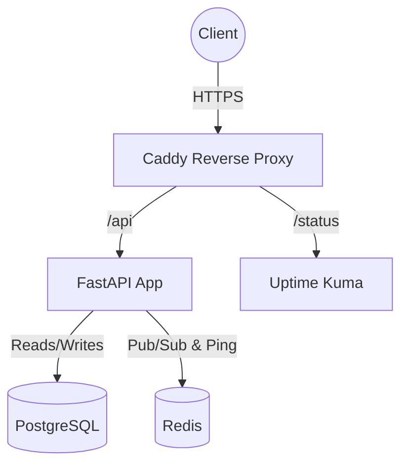

# StatusPulse

StatusPulse is a lightweight status page and health monitoring API.

## Architecture Diagram



## Prerequisites
- Docker and Docker Compose
- `make` utility

## Local Development

1. **Environment Setup:**
   ```bash
   make .env
   # Update the values in .env if necessary
   ```

2. **Start the Stack:**
   ```bash
   make up
   ```

3. **Verify Health:**
   ```bash
   make test
   ```

4. **View Logs:**
   ```bash
   make logs
   ```

5. **Stop the Stack:**
   ```bash
   make down
   ```

## CI/CD Pipeline

The project uses GitHub Actions for continuous integration and deployment.

- **CI (`ci.yml`):** Triggers on pushes and PRs to `main`. It lints the code, scans the Dockerfile, builds the image, starts the full stack using Docker Compose, and runs integration tests (`tests/test_integration.sh`).
- **Deploy (`deploy.yml`):** Triggers on pushes to `main` after a successful CI run. It builds and tags the Docker image, pushes it to GitHub Container Registry (`ghcr.io`), connects to the remote server via SSH to execute the deployment script, and sends success/failure notifications.

## Deploy to Production

1. **Provision Infrastructure:**
   Navigate to the `terraform/` directory and follow the instructions in the README to provision an AWS EC2 instance.

2. **Server Configuration:**
   SSH into the newly created server. Ensure Docker and Docker Compose are installed. Clone this repository or copy the necessary deployment files (`docker-compose.yml`, `.env`, `caddy/Caddyfile`, `scripts/deploy.sh`).
   Set up your `.env` file with production secrets. Export `DOMAIN=<your-domain>` for Caddy.

3. **Deployment Script:**
   The `scripts/deploy.sh` script is used to deploy new versions with zero downtime. It pulls the latest image, starts the updated stack, verifies health, and can optionally roll back on failure.

## Monitoring and Alerting

- **Uptime Kuma:** Deployed alongside the stack, accessible at `/status` (via Caddy routing) or port `3001`. It monitors the `/health` endpoint, PostgreSQL, Redis, and TLS expiry.
- **Health Monitor Script:** A cron job (`scripts/health-monitor.sh`) runs every 5 minutes to check endpoint health, disk usage, memory, container status, and TLS expiry. It sends alerts via a configured webhook (`ALERT_WEBHOOK_URL`).

## Backup and Restore

A daily cron job runs `scripts/backup.sh` to create a `pg_dump` of the PostgreSQL database, gzip it, and keep the last 7 backups. It can optionally upload to an S3 bucket if `S3_BUCKET` is configured.

## Troubleshooting

- **Containers failing to start:** Check `docker compose logs` for specific service errors.
- **Database Connection Issues:** Verify credentials in `.env` and ensure the database container is healthy.
- **Caddy/HTTPS Issues:** Check Caddy logs (`docker compose logs caddy`). Ensure DNS records are correctly pointing to the server IP and ports 80/443 are open on the firewall.